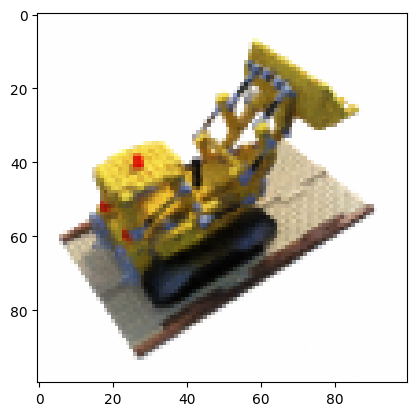
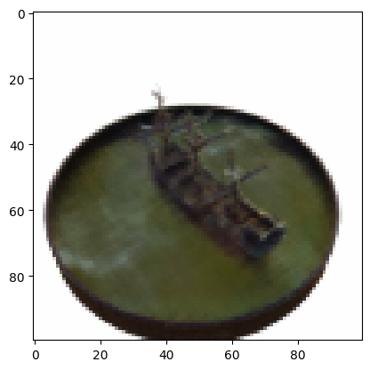

# Handmade NeRF Project
Implementation [NeRF](https://www.matthewtancik.com/nerf)
from scratch with PyTorch  
I will make sure to implement more features in the near future.
<table border="0">
  <tr>
    <td>
      <figure>
        <br>
        <figcaption style="text-align: center;">The test data of the lego</figcaption>
      </figure>
    </td>
    <td>
      <figure>
        <br>
        <figcaption style="text-align: center;">The test data of the ship</figcaption>
      </figure>
    </td>
  </tr>
</table>

## Requirement
PyTorch  
Numpy  
pillow  
tqdm  
matplotlib

## Usage
Setup
```bash
git clone https://github.com/matchang-dt/nerf_project
cd nerf_project
mkdir data
```
Download the [official dataset](https://drive.google.com/drive/folders/1cK3UDIJqKAAm7zyrxRYVFJ0BRMgrwhh4), unzip it and place it in the `data` folder. Currently, this program only supports synthetic data.  
Resample the data. Smaller sizes are convenient for testing and experimentation.
```bash
# Specify the resampling size and target data.
python data_resampling.py --resolution 100 lego
```
```Python
import os
import torch
from rendering import render_with_json
from train import train

base_dir = "data/nerf_synthetic/lego"
train_json = os.path.join(base_dir, "transforms_train_100.json")
val_json = os.path.join(base_dir, "transforms_val_100.json")
save_folder = "models/"

train(base_dir, train_json, val_json, save_folder)
# takes 30-40min to train a model with 100*100 images with default setting

folder = "250512050846" # specify the folder including trained model

if folder:
  hparam_path = f"models/{folder}/hparams_{folder}.pth"
  coarse_path = f"models/{folder}/coarse_{folder}.pth"
  fine_path = f"models/{folder}/fine_{folder}.pth"

input_json = os.path.join(base_dir, "transforms_test_100.json")
data_idx = 15
render_with_json(input_json, data_idx, hparam_path, coarse_path, fine_path)
```


